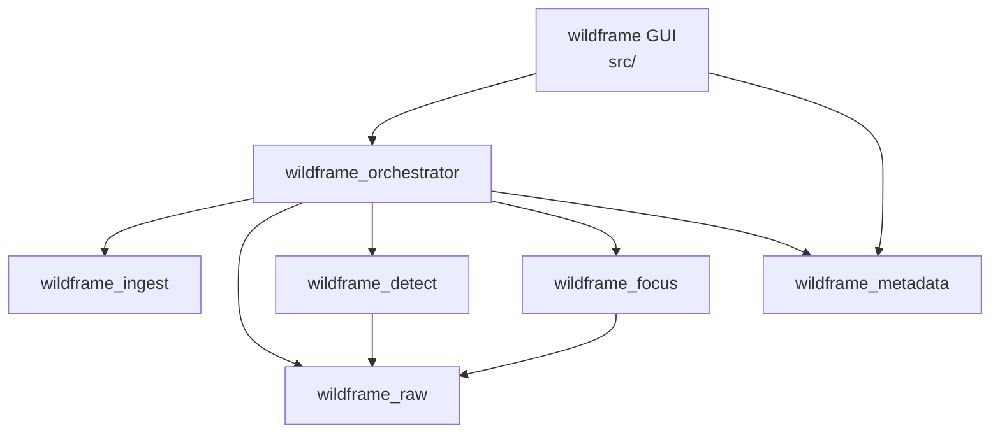

# Wildframe Architecture

This document describes how Wildframe's modules fit together: their
dependency graph, their individual responsibilities, how a single
image flows through the pipeline, and the extension point Phase 2+
stages will use.

It is the architectural companion to `bird_photo_ai_project_handoff.md`
§10 (module responsibilities), §11 (repo layout), and §12 (data flow).
Where this file and the handoff doc disagree, the **handoff doc
wins** — flag the drift per `CLAUDE.md` §5 rather than editing either
file to paper over it.

**Scope.** MVP only. Phase 2+ modules (`wildframe_species`,
`wildframe_feedback`, `wildframe_lightroom`) are mentioned only where
the extension point they will plug into is relevant.

---

## 1. Module dependency graph

Seven targets make up the MVP: six static libraries (`libs/*/`) and
one GUI executable (`src/`). Headers are the only coupling — every
edge below corresponds to a `target_link_libraries(... PRIVATE ...)`
or `... PUBLIC ...` edge that exposes a type across the API boundary.



### Why these edges and not others

- **`orchestrator` is the only module that fans out.** Per handoff
  §10, it owns the pipeline order and the job queue. Every module
  below it is a leaf from the orchestrator's perspective.
- **`detect` and `focus` depend on `raw` at the type level** because
  they consume `PreviewImage` (produced by `raw`, see M2-01, M3-05,
  M4-06). They do **not** depend on each other — they are
  independent scoring passes over the same preview.
- **`metadata` has no upstream module dependencies.** It owns Exiv2
  and nothing else (handoff §10, Module 5). It reads EXIF from the
  RAW file directly and writes XMP to the sidecar. It does not go
  through `raw` — Exiv2 opens CR3 files itself.
- **The GUI depends on `metadata` directly**, not only through the
  orchestrator, because the detail view and filter predicates (FR-6,
  FR-8) read sidecars out of band from any running batch.
- **`ingest` is a sibling, not an upstream, of `raw`.** `ingest`
  produces `ImageJob` records from the filesystem; it does not
  decode pixels. The orchestrator hands an `ImageJob` to `raw`,
  which opens the file.
- **No edge from any module into `orchestrator` or the GUI.** The
  pipeline is a strict DAG: leaf modules are reusable from a headless
  CLI or a Phase 3 Lightroom plugin without touching Qt or the
  orchestrator.

### Third-party dependency boundaries

Each module owns exactly one heavy third-party C or C++ library and
catches its exceptions at the public API (see `docs/STYLE.md` §3.1).
The boundary is part of the architecture, not an implementation
detail:

| Module | Owns | Boundary error type |
|---|---|---|
| `wildframe_ingest` | `std::filesystem` | `wildframe::ingest::IngestError` |
| `wildframe_raw` | LibRaw | `wildframe::raw::RawDecodeError` |
| `wildframe_detect` | ONNX Runtime | `wildframe::detect::DetectError` |
| `wildframe_focus` | OpenCV | `wildframe::focus::FocusError` |
| `wildframe_metadata` | Exiv2 | `wildframe::metadata::MetadataError` |
| `wildframe_orchestrator` | nlohmann/json, spdlog | `wildframe::orchestrator::OrchestratorError` |
| `wildframe` (GUI) | Qt 6 Widgets, tomlplusplus | (GUI boundary — surfaces in the UI) |

---

## 2. Module purposes

One paragraph per module. For the full feature list see handoff §10;
for public-API acceptance criteria see `docs/BACKLOG.md`.

### `wildframe_ingest` (Module 1)

Discovers RAW input. Walks a user-selected directory (depth 1 by
default, configurable), filters to CR3 by extension and magic bytes,
skips symlinks, and emits a deterministic, path-sorted
`std::vector<ImageJob>`. Does no pixel work — every `ImageJob` is
just metadata about where a file lives. Malformed files are logged
and skipped, not fatal (FR-1, handoff §10).

### `wildframe_raw` (Module 2)

RAW pixel access. Thin RAII wrapper around `LibRaw`. Exposes two
operations: extract the largest embedded JPEG preview from a CR3
(the fast path that drives inference), and decode-with-crop a
full-resolution region (the slow fallback for focus scoring on
small subjects, FR-2 / FR-4). Does **not** own Exiv2 — all metadata
reads and writes are consolidated in `wildframe_metadata` so one
module owns the library (handoff §10).

### `wildframe_detect` (Module 3)

Object detection. Wraps an `Ort::Session` with a runtime-
configurable execution provider (CoreML default, CPU fallback).
Ships two preprocessing/postprocessing paths behind a single
`DetectionResult` output contract: YOLOv11 (COCO-80, bird class 14)
and MegaDetector v6 as a pluggable alternative (handoff §5 GPU
strategy, §10). Primary-subject selection is deterministic: max
confidence, ties broken by bbox area (FR-3).

### `wildframe_focus` (Module 4)

Classical image-quality scoring on the primary subject. Computes
Variance-of-Laplacian focus, FFT high-frequency energy (motion
blur), subject-size percent, and edge-clipping flags via OpenCV,
then combines them into a keeper score through a weighted formula
whose weights live in a versioned `FocusConfig` loaded from the
TOML runtime config (FR-4, FR-11). No ML — classical CV only.

### `wildframe_metadata` (Module 5)

Sole owner of Exiv2. Covers three distinct concerns that share one
library: (1) deterministic EXIF read from the RAW file into a
`DeterministicMetadata` struct; (2) XMP sidecar write of AI and
provenance fields in the `wildframe:*` and `wildframe_provenance:*`
namespaces via Exiv2's high-level API (atomic via temp-file +
rename, preserving non-Wildframe XMP); (3) XMP sidecar read for
GUI filter/display, including `wildframe_user:*` overrides written
back from the detail view. The XMP sidecar is the source of truth
(handoff §13, FR-5, FR-6, FR-8, NFR-4, NFR-5).

### `wildframe_orchestrator` (Module 6)

The only module that knows the pipeline order. Drains a thread-safe
job queue on a single background worker thread, runs each image
through a sequence of `PipelineStage` implementations (see §4), and
writes a per-batch JSON manifest as an append-only run log. Isolates
per-image failures so one bad CR3 logs an error row and the batch
continues; only catastrophic errors (OOM, corrupt ONNX model) abort.
Exposes a cooperative `cancel()` entry point (FR-9) and a progress
callback the GUI consumes (handoff §10, §12, FR-5).

### `wildframe` GUI (Module 7)

Qt 6 Widgets executable under `src/`. Directory picker → batch
runner → progress view → thumbnail grid → detail view → override
UI. Runs the orchestrator on a dedicated worker thread and
marshals progress back via Qt signals, per the handoff §5 threading
strategy. Reads XMP sidecars directly (via `wildframe_metadata`)
for filtering and display so the detail view does not require a
running batch (FR-6, FR-8, FR-9, FR-10).

---

## 3. Data flow walkthrough

Mirrors handoff §12. The walkthrough below is the authoritative
trace of which module owns each step, which types cross each
boundary, and where errors are contained.

### 3.1 Batch start

```
User → GUI → Orchestrator → Ingest
```

1. User picks a directory in the Qt GUI (`Module 7`).
2. If any existing `wildframe:*` sidecars are found in the
   directory, the GUI shows the re-analysis prompt (FR-10, S0-21).
   The user's choice (*skip already-analyzed* / *overwrite all* /
   *cancel*) is captured before any jobs are queued.
3. GUI calls `wildframe_ingest::enumerate(dir, max_depth)`.
4. `Ingest` returns `std::vector<ImageJob>` — sorted by path, CR3-
   filtered, symlinks skipped, malformed files logged and dropped.
5. GUI hands the vector to `wildframe_orchestrator`, which enqueues
   jobs on the background worker's FIFO queue.

### 3.2 Per-image pipeline

For each `ImageJob` drained from the queue, the orchestrator runs
the following stages in order:

```
Raw.extract_preview
    → Metadata.read_exif
        → Detect.detect
            → Focus.score
                → Metadata.write_sidecar
                    → Orchestrator.append_manifest_row
```

1. **`Raw.extract_preview(job.path) → PreviewImage`.** Largest
   embedded JPEG, decoded to RGB + dimensions. LibRaw exceptions
   are caught and translated to `RawDecodeError` at this boundary.
2. **`Metadata.read_exif(job.path) → DeterministicMetadata`.** Runs
   in parallel-order *semantically* (it does not depend on the
   preview), but sequentially in the MVP single-consumer worker.
   Exiv2 exceptions translated to `MetadataError`.
3. **`Detect.detect(preview, cfg) → DetectionResult`.** YOLOv11 or
   MegaDetector per runtime config. Emits `bird_present`,
   `bird_count`, `bird_boxes`, `primary_subject_box`, and
   `detection_confidence`. Ort exceptions translated to
   `DetectError`.
4. **`Focus.score(preview, primary_subject_box, cfg) → FocusResult`.**
   Only if `bird_present`; otherwise keeper score is zero and
   `Focus` is skipped. If the bbox is small enough that the preview
   resolution is insufficient, the stage calls
   `Raw.decode_crop(job.path, bbox) → CroppedImage` as a fallback
   (FR-4, §15 technical risks).
5. **`Metadata.write_sidecar(job.path, ai, provenance)`.** Atomic
   temp-file + rename. Preserves any non-Wildframe XMP that was
   already in the sidecar. Provenance fields (`pipeline_version`,
   `detector_model_name`, `detector_model_version`, timestamps) are
   populated here, not earlier, so a single run records a single
   timestamp.
6. **`Orchestrator.append_manifest_row(...)`.** One JSON row per
   image: input path, sidecar path, per-stage timings, and error
   if any. The manifest header records pipeline-wide provenance
   once per run (FR-5, NFR-5).

**Error isolation.** The orchestrator catches
`wildframe::<module>::*Error` around each stage, writes the failing
row to the manifest with its error, and moves on. Per handoff §5 and
FR-5, a single bad file never aborts a batch.

**Cancellation.** After each stage boundary the orchestrator checks
the cancel flag. On set: finishes the current stage (cooperative,
not forceful), records `status: cancelled` in the manifest, and
returns. Sidecars already written are retained — no rollback
(FR-9).

### 3.3 Review phase

```
GUI ← Metadata.read_sidecar (per thumbnail)
GUI → Metadata.write_user_override (per approve/reject/note)
```

The review UI does not re-enter the orchestrator. Thumbnail
population and filter predicates read sidecars directly through
`wildframe_metadata` — so reviewing is possible on an earlier batch
without a worker thread running. User overrides round-trip through
`write_user_override`, which touches only the `wildframe_user:*`
namespace and never the AI namespace (FR-6).

---

## 4. Extension point: `PipelineStage` (NFR-3)

NFR-3 requires that new pipeline stages be added by implementing a
documented interface and registering the stage — with **no changes
to the orchestrator core**. The MVP provides that interface via
`PipelineStage` (introduced in M6-01).

### 4.1 Contract

`PipelineStage` is an abstract base with one polymorphic method:

```cpp
namespace wildframe::orchestrator {

/// Abstract base for a single step in the per-image pipeline.
/// Concrete stages are registered with the orchestrator at
/// construction time; the orchestrator invokes them in registration
/// order for each job drained from the queue.
class PipelineStage {
public:
    virtual ~PipelineStage() = default;

    /// Processes one job. On success, returns a StageResult carrying
    /// outputs the downstream stages may consume. On expected,
    /// per-image failure (e.g. malformed preview), throws the
    /// owning module's Wildframe error type — never a third-party
    /// exception, per docs/STYLE.md §3.
    virtual StageResult process(const Job& job) = 0;
};

}  // namespace wildframe::orchestrator
```

The MVP ships three concrete implementations — `DetectStage`,
`FocusStage`, `MetadataWriteStage` — each delegating to its
respective module's public API. `ingest`, `raw`, and EXIF-read are
orchestrated outside the stage list because they are prerequisites
the stage list consumes (see §3.2).

### 4.2 Registration

Stages register at orchestrator construction time, not dynamically
at runtime. MVP registers them in code; Phase 2+ additions register
the same way. The orchestrator core does not need to know about new
stage types — it iterates the `std::vector<std::unique_ptr<PipelineStage>>`
it was given.

### 4.3 Planned Phase 2+ stages

Illustrative — not promises. These are the stages the extension
point is designed to absorb without orchestrator edits:

- **`SpeciesStage`** (`wildframe_species`, Phase 2). Runs after
  `DetectStage`, consumes the primary subject crop, emits top-k
  species predictions into a new `wildframe_species:*` namespace.
- **`FeedbackStage`** (`wildframe_feedback`, Phase 2). Runs *at
  review time*, not during batch analysis — captures user overrides
  as training-ready label rows. Plugs into the same
  `PipelineStage` contract but is driven by the GUI, not the
  orchestrator worker.
- **`LightroomExportStage`** (`wildframe_lightroom`, Phase 3).
  Emits Lightroom-compatible smart-collection criteria as a
  terminal stage after metadata write.

Adding any of the above to MVP is explicitly out of scope per
`CLAUDE.md` §6.

### 4.4 What Phase 2+ may **not** do through this interface

The extension point is about **how** work fits into the pipeline,
not about expanding scope. Per `CLAUDE.md` §5 ("Scope the judgment")
and `CONTRIBUTING.md` (Plan change proposals / Scope guard), adding
a stage is a plan change when it introduces new namespaces, new
third-party dependencies, or new user-visible behavior — not a
silent registration call.

---

## 5. Threading model

Per handoff §5 threading strategy, MVP has exactly two application-
owned threads:

1. **Qt main thread** (GUI only). Never blocks on pipeline work.
   All user input, widget updates, and Qt signal delivery happen
   here.
2. **One background worker thread** (orchestrator-owned). Drains
   the job queue and runs the per-image pipeline (§3.2). Progress
   updates cross back to the main thread as Qt signals; no shared
   mutable state beyond the queue and a cancel flag, both behind
   the orchestrator's own synchronization.

ONNX Runtime handles its own intra-op parallelism and GPU dispatch
inside a single `detect()` call. OpenCV's internal parallelism is
left at defaults. There is no per-image application-level
threading in v1.

**Per-module concurrency contracts** (NFR-9) are documented on each
module's public header. The orchestrator is thread-compatible (one
instance, one worker). `wildframe_metadata` documents its own
serialization between GUI-side reads and worker-side writes; every
other module is single-threaded or thread-compatible in MVP.

If throughput becomes a bottleneck, a producer–consumer pipeline
(decode → infer → score → write) can be added without changing
module boundaries or the `PipelineStage` contract — the change lives
inside the orchestrator.

---

## 6. Out-of-band paths

Not every interaction goes through the orchestrator. These are the
legitimate bypasses, documented here so future contributors do not
"fix" them into orchestrator calls:

- **GUI → `wildframe_metadata`** for thumbnail-grid population,
  filter predicates, detail view, and user-override writes. The
  orchestrator is for batch analysis; review is a read/write
  against sidecars that already exist.
- **CMake configure → `tools/fetch_models.cmake`** to download
  ONNX weights. Not part of any module — a build-system concern
  (handoff §11, S0-11).
- **Every module → spdlog** directly. The logging sink is a
  process-global initialized once at startup (S0-14); it is not an
  orchestrator responsibility.
- **Every module → `tomlplusplus` config** indirectly through the
  strongly-typed config structs they receive (`DetectConfig`,
  `FocusConfig`, …). Modules do not parse TOML themselves; the GUI
  / CLI entry point does (FR-11, S0-18).
